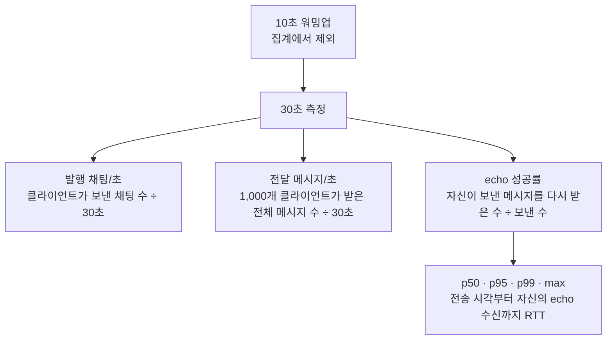

# BlazeChat

Tokio, WebSocket, Redis Pub/Sub으로 만든 수평 확장형 Rust 채팅 서버입니다. HAProxy가 WebSocket 연결을 4개 서버 프로세스에 분산하고 Redis가 프로세스 사이의 메시지를 전달합니다.

## 구성

```text
clients ── WebSocket ── HAProxy
                         ├── chat1 ─┐
                         ├── chat2 ─┤
                         ├── chat3 ─┼── Redis Pub/Sub
                         └── chat4 ─┘
```

- 비동기 런타임: Tokio 멀티스레드
- WebSocket/HTTP: Axum
- 프로세스 간 fan-out: Redis Pub/Sub
- 프로세스 내부 fan-out: Tokio broadcast channel
- 부하 분산: HAProxy `leastconn`
- 총 서버 측 CPU 제한: **4 cores** (채팅 서버 3.0 + Redis 0.5 + HAProxy 0.5)
- 상태 확인: `GET /health`
- Prometheus 텍스트 형식 지표: `GET /metrics`

## 실행

Docker Desktop 또는 Docker Engine과 Compose v2가 필요합니다.

```bash
docker compose up -d --build
curl http://localhost:8080/health
```

WebSocket 주소는 `ws://localhost:8080/ws`입니다. 클라이언트 메시지:

```json
{"room":"general","user":"alice","text":"hello","client_ts_ns":0,"sequence":1}
```

서버는 모든 프로세스에서 같은 방 메시지를 수신하도록 Redis를 거친 뒤 연결된 클라이언트에 전달합니다. 현재 구현은 전체 메시지를 각 프로세스에 전달한 뒤 클라이언트가 방을 선택하는 단순한 벤치마크 기반 구조입니다. 실제 서비스에서는 인증, 방별 구독 필터, Redis Cluster 또는 NATS/Kafka, 영속 저장소를 추가해야 합니다.

## 벤치마크

Windows PowerShell:

```powershell
.\scripts\benchmark.ps1 -Connections 1000 -Duration 30 -Warmup 10 -MessagesPerSecond 10

# 단계별로 접속/전송률을 올리고 실패 임계점에서 멈추는 전체 스위트
.\scripts\benchmark-suite.ps1
```

Linux/macOS:

```bash
CONNECTIONS=1000 DURATION=30 WARMUP=10 MESSAGES_PER_SECOND=10 ./scripts/benchmark.sh
```

`connections`를 단계적으로 올려 최대 동시 접속 수를 찾고, 접속 수를 고정한 뒤 `messages-per-second`를 올려 처리량과 지연을 측정합니다. `published_messages_per_second`는 서버에 발행한 채팅 수, `delivered_messages_per_second`는 같은 방의 모든 연결에 fan-out된 전달 수입니다. 지연은 클라이언트가 보낸 타임스탬프부터 같은 클라이언트가 Redis fan-out 메시지를 다시 받을 때까지의 종단 간 RTT입니다.

권장 측정 순서:

```bash
# 연결 한계: 메시지를 보내지 않고 10k, 25k, 50k... 단계 상승
docker compose run --rm bench \
  --url ws://proxy:8080/ws --mode connections --connections 10000 --duration 30

# 처리량/지연: 연결당 초당 전송률을 단계 상승
docker compose run --rm bench \
  --url ws://proxy:8080/ws --mode throughput --connections 1000 \
  --messages-per-second 10 --warmup 10 --duration 30
```

### 측정 과정

처리량 테스트에서는 벤치마크 컨테이너가 1,000개의 WebSocket 클라이언트를 만들고 모두 같은 방에 참여시킵니다. 각 클라이언트가 보낸 채팅은 HAProxy가 선택한 서버에서 Redis로 발행되고, Redis가 네 서버에 다시 배포한 뒤 각 서버가 자신에게 연결된 클라이언트들에게 전달합니다.




같은 채팅 하나가 여러 클라이언트에게 전달되므로 `전달 메시지/초`는 `발행 채팅/초`보다 클 수 있습니다. 이론상 1,000 chat/s를 1,000명이 모두 받으면 1,000,000 msg/s이지만, CPU·Redis·broadcast queue가 포화되면 지연과 드롭이 발생합니다. 따라서 실제 지속 가능 여부는 전달량만이 아니라 echo 성공률과 p99 지연을 함께 봐야 합니다.

### 측정 결과

2026-07-30에 Docker Desktop에서 서버 측 CPU를 총 4코어(chat 3.0, Redis 0.5, HAProxy 0.5)로 제한하고 10초 워밍업 후 30초 동안 1회 측정한 결과입니다. 연결 테스트의 50,000 단계는 28,231개만 연결되어 실패했으며, 처리량 테스트는 5,000 chat/s부터 자신의 메시지 echo 성공률이 99% 미만으로 떨어졌습니다. 자동 중단 이후의 10,000~50,000 chat/s 단계는 각 단계 전에 서버를 재시작하여 개별 측정했습니다.

| 테스트 | 동시 접속자 | 발행 채팅/초 | 전달 메시지/초 | echo 성공률 | p50 ms | p95 ms | p99 ms | max ms | 오류 |
|---|---:|---:|---:|---:|---:|---:|---:|---:|---:|
| 연결 1,000 요청 | 1,000 | 0 | 0 | — | — | — | — | — | 0 |
| 연결 5,000 요청 | 5,000 | 0 | 0 | — | — | — | — | — | 0 |
| 연결 10,000 요청 | 10,000 | 0 | 0 | — | — | — | — | — | 0 |
| 연결 25,000 요청 | 25,000 | 0 | 0 | — | — | — | — | — | 0 |
| 연결 50,000 요청 | 28,231 | 0 | 0 | — | — | — | — | — | 21,769 |
| 처리량 1 msg/s/client | 1,000 | 1,000 | 62,501 | 100% | 192 | 389 | 394 | 488 | 0 |
| 처리량 5 msg/s/client | 1,000 | 5,000 | 228,141 | 73% | 7,397 | 11,289 | 12,091 | 13,099 | 0 |
| 처리량 10 msg/s/client | 1,000 | 10,000 | 261,454 | 41.8% | 7,098 | 8,995 | 9,699 | 10,011 | 0 |
| 처리량 25 msg/s/client | 1,000 | 25,000 | 345,571 | 22.1% | 3,557 | 5,161 | 5,579 | 7,242 | 0 |
| 처리량 50 msg/s/client | 1,000 | 50,000 | 283,217 | 9.1% | 2,408 | 4,104 | 4,891 | 7,291 | 0 |

결과 해석 시 부하 발생기를 서버와 같은 4코어 제한에 넣지 마세요. 최대 접속 수는 OS의 열린 파일 수, Docker 메모리, NAT/포트 범위에도 영향을 받습니다. 최소 3회 실행한 중앙값을 사용하고, p99가 목표 SLO를 넘거나 오류/드롭이 발생하기 직전 단계를 지속 가능한 최대치로 기록하는 것을 권장합니다.

전체 스위트는 `benchmark-results/*-suite.md`에 README로 복사할 수 있는 표를 자동 생성합니다. 기본 중단 기준은 연결 성공률 98% 미만, 연결 오류 발생, 또는 자신의 메시지 echo 성공률 99% 미만입니다.

## 로컬 개발

```bash
cargo fmt --all -- --check
cargo test --workspace
cargo clippy --workspace --all-targets -- -D warnings
```

환경 변수:

| 이름 | 기본값 | 설명 |
|---|---|---|
| `BIND_ADDR` | `0.0.0.0:8080` | 서버 listen 주소 |
| `REDIS_URL` | `redis://127.0.0.1:6379/` | Redis URL |
| `INSTANCE_ID` | UUID | 프로세스 식별자 |
| `FANOUT_CAPACITY` | `65536` | 프로세스 내부 broadcast queue |
| `RUST_LOG` | 비어 있음 | tracing 로그 필터 |
