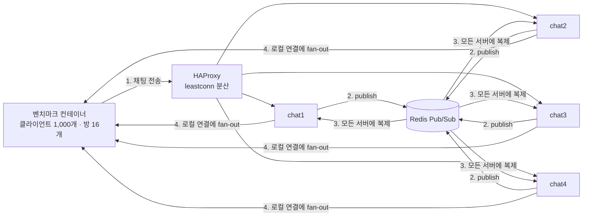
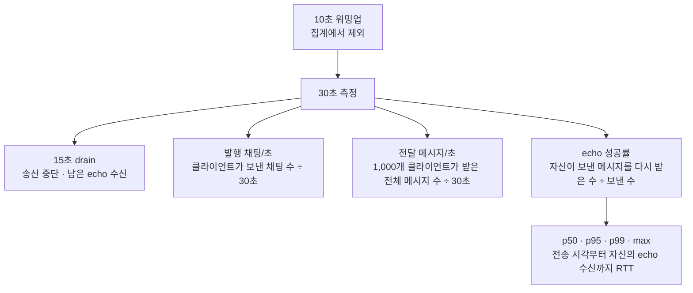

# BlazeChat

Tokio, WebSocket, Redis Pub/Sub으로 만든 수평 확장형 Rust 채팅 서버입니다. HAProxy가 WebSocket 연결을 4개 서버 프로세스에 분산하고 Redis가 프로세스 사이의 메시지를 전달합니다.

## 구성

```text
clients ── WebSocket ── HAProxy
                         ├── chat1 ─┐
                         ├── chat2 ─┤
                         ├── chat3 ─┼── Redis Pub/Sub
                         └── chat4 ─┘
```

- 비동기 런타임: Tokio 멀티스레드
- WebSocket/HTTP: Axum
- 프로세스 간 fan-out: Redis Pub/Sub
- 프로세스 내부 fan-out: Tokio broadcast channel
- 부하 분산: HAProxy `leastconn`
- 총 서버 측 CPU 제한: **4 cores** (채팅 서버 3.0 + Redis 0.5 + HAProxy 0.5)
- 상태 확인: `GET /health`
- Prometheus 텍스트 형식 지표: `GET /metrics`

## 실행

Docker Desktop 또는 Docker Engine과 Compose v2가 필요합니다.

```bash
docker compose up -d --build
curl http://localhost:8080/health
```

WebSocket 주소는 `ws://localhost:8080/ws`입니다. 클라이언트 메시지:

```json
{"room":"general","user":"alice","text":"hello","client_ts_ns":0,"sequence":1}
```

서버는 모든 프로세스에서 같은 방 메시지를 수신하도록 Redis를 거친 뒤 연결된 클라이언트에 전달합니다. 현재 구현은 전체 메시지를 각 프로세스에 전달한 뒤 클라이언트가 방을 선택하는 단순한 벤치마크 기반 구조입니다. 실제 서비스에서는 인증, 방별 구독 필터, Redis Cluster 또는 NATS/Kafka, 영속 저장소를 추가해야 합니다.

## 벤치마크

Windows PowerShell:

```powershell
.\scripts\benchmark.ps1 -Connections 1000 -Duration 30 -Warmup 10 -MessagesPerSecond 10

# 단계별로 접속/전송률을 올리고 실패 임계점에서 멈추는 전체 스위트
.\scripts\benchmark-suite.ps1
```

Linux/macOS:

```bash
CONNECTIONS=1000 DURATION=30 WARMUP=10 MESSAGES_PER_SECOND=10 ./scripts/benchmark.sh
```

`connections`를 단계적으로 올려 최대 동시 접속 수를 찾고, 접속 수를 고정한 뒤 `messages-per-second`를 올려 처리량과 지연을 측정합니다. `published_messages_per_second`는 서버에 발행한 채팅 수, `delivered_messages_per_second`는 같은 방의 모든 연결에 fan-out된 전달 수입니다. 지연은 클라이언트가 보낸 타임스탬프부터 같은 클라이언트가 Redis fan-out 메시지를 다시 받을 때까지의 종단 간 RTT입니다.

권장 측정 순서:

```bash
# 연결 한계: 메시지를 보내지 않고 10k, 25k, 50k... 단계 상승
docker compose run --rm bench \
  --url ws://proxy:8080/ws --mode connections --connections 10000 --duration 30

# 처리량/지연: 연결당 초당 전송률을 단계 상승
docker compose run --rm bench \
  --url ws://proxy:8080/ws --mode throughput --connections 1000 \
  --messages-per-second 10 --warmup 10 --duration 30
```

### 측정 과정

처리량 테스트에서는 벤치마크 컨테이너가 1,000개의 WebSocket 클라이언트를 만들고 16개 방에 라운드 로빈으로 배치합니다. 방마다 약 62~63명이 참여합니다. 각 클라이언트가 보낸 채팅은 HAProxy가 선택한 서버에서 Redis로 발행되고, Redis가 네 서버에 다시 배포한 뒤 각 서버가 같은 방에 있으면서 자신에게 연결된 클라이언트들에게 전달합니다.





같은 채팅 하나가 같은 방의 약 62~63명에게 전달되므로 `전달 메시지/초`는 `발행 채팅/초`보다 큽니다. 이론상 1,000 chat/s를 방당 평균 62.5명이 받으면 약 62,500 msg/s이며, 실제 측정값 62,501 msg/s와 일치합니다. CPU·Redis·broadcast queue가 포화되면 지연과 드롭이 발생하므로 실제 지속 가능 여부는 전달량만이 아니라 echo 성공률과 p99 지연을 함께 봐야 합니다.

### 측정 결과

2026-07-30에 Docker Desktop에서 측정했습니다. 각 단계 전에 서버를 재시작하고 5초 동안 백엔드 준비를 기다렸습니다. 처리량은 10초 워밍업, 30초 송신 및 측정, 15초 drain 순서로 실행했습니다. drain 중에는 새 메시지를 보내지 않고 이미 보낸 메시지의 echo만 기다립니다.

#### 측정 환경

| 항목 | 설정 |
|---|---|
| 서버 구성 | chat 서버 4개 + Redis + HAProxy |
| 서버 CPU 제한 | 총 4코어: chat 3.0, Redis 0.5, HAProxy 0.5 |
| 메모리 제한 | chat 각 1 GiB, Redis 1 GiB, HAProxy 1 GiB |
| 처리량 테스트 연결 | WebSocket 클라이언트 1,000개 |
| 방 구성 | 16개 방, 클라이언트를 라운드 로빈 배치 |
| 워밍업 | 10초, 결과 집계에서 제외 |
| 측정 시간 | 30초 |
| drain | 15초, 송신 종료 후 남은 echo 수신 |

#### 연결 결과

연결 테스트에서는 메시지를 보내지 않고 WebSocket 연결 수립과 유지 여부만 측정했습니다.

| 요청 연결 | 실제 연결 | 연결 시간(초) | 오류 | 결과 |
|---:|---:|---:|---:|---|
| 1,000 | 1,000 | 1 | 0 | 성공 |
| 5,000 | 5,000 | 3 | 0 | 성공 |
| 10,000 | 10,000 | 8 | 0 | 성공 |
| 25,000 | 24,885~25,000 | 13~17 | 0~115 | 경계 |
| 50,000 | 28,231 | 12 | 21,769 | 실패 |

#### 처리량 결과

`30초 전송 시도`는 `클라이언트당 전송률 × 1,000명 × 30초`입니다. `자기 echo 수신`은 전송한 메시지 중 같은 발신자에게 다시 돌아온 건수이며, echo 성공률의 분자입니다.

| 클라이언트당 전송/초 | 30초 전송 시도 | 발행 채팅/초 | 전체 클라이언트 수신/초 | 자기 echo 수신 | echo 성공률 | p50 ms | p95 ms | p99 ms | max ms | 오류 |
|---:|---:|---:|---:|---:|---:|---:|---:|---:|---:|---:|
| 1 | 30,000 | 1,000 | 61,814 | 30,000 | 100% | 256 | 361 | 452 | 459 | 0 |
| 2 | 60,000 | 2,000 | 124,306 | 59,777 | 99.6% | 179 | 368 | 372 | 378 | 0 |
| 3 | 90,000 | 3,000 | 186,815 | 89,871 | 99.9% | 263 | 481 | 657 | 1,034 | 0 |
| 4 | 120,000 | 4,000 | 249,218 | 119,688 | 99.7% | 8,389 | 10,936 | 11,706 | 13,746 | 0 |
| 5 | 150,000 | 5,000 | 289,470 | 138,775 | 92.5% | 13,255 | 15,958 | 17,351 | 18,760 | 0 |

### 분석 결과

#### 운영 한계

| 구간 | 판정 | 근거 |
|---|---|---|
| 2,000 chat/s | 권장 운영점 | echo 99.6%, p99 372ms, 실제 CPU 약 2.34코어 |
| 3,000 chat/s | 경계 | echo 99.9%, p99 657ms, HAProxy가 0.5코어 제한의 약 97% 사용 |
| 4,000 chat/s | 실시간 처리 실패 | drain 후 echo는 99.7%지만 p99 11.7초로 큐 적체 발생 |
| 5,000 chat/s | 포화 | drain 후에도 echo 92.5%, p99 17.4초 |

현재 구성에서는 **2,000 chat/s를 여유가 있는 운영 권장값**, **3,000 chat/s를 벤치마크상 최대 경계값**으로 봅니다. 4,000 chat/s부터는 메시지가 즉시 유실되기보다 큐에 오래 머물다가 drain 중 회수되는 상태이므로 실시간 채팅 처리량으로 인정하지 않습니다.

#### 코어당 처리량과 자원 사용

1,000명 × 클라이언트당 2 msg/s인 권장 운영점에서 측정한 값입니다. CPU와 메모리는 측정 중 `docker stats` 스냅샷이며 Docker Desktop 자체 오버헤드는 제외합니다.

| 구성 요소 | 실제 CPU | CPU 제한 대비 | 메모리 |
|---|---:|---:|---:|
| chat 서버 4개 합계 | 1.85코어 | 3코어의 62% | 158MiB |
| HAProxy | 0.45코어 | 0.5코어의 90% | 44MiB |
| Redis | 0.03코어 | 0.5코어의 7% | 8MiB |
| 합계 | 2.34코어 | 할당 4코어의 59% | 210MiB |

- 할당 CPU 기준 발행 처리량: **코어당 500 chat/s** (`2,000 ÷ 4`)
- 실제 사용 CPU 기준 발행 처리량: **코어당 약 854 chat/s** (`2,000 ÷ 2.34`)
- 할당 CPU 기준 fan-out 수신량: **코어당 약 31,000 msg/s** (`124,306 ÷ 4`)
- 첫 CPU 병목: HAProxy. 2,000 chat/s에서 이미 0.5코어 제한의 약 90%를 사용합니다.

#### 트래픽

권장 운영점에서 부하 컨테이너의 네트워크 인터페이스 바이트를 10초 워밍업 + 30초 측정 동안 직접 집계했습니다. WebSocket/TCP 오버헤드를 포함합니다.

| 방향 | 전체 | 사용자 1명당 |
|---|---:|---:|
| 서버 → 클라이언트 | 약 231Mbps | 약 28.9KB/s |
| 클라이언트 → 서버 | 약 9Mbps | 약 1.1KB/s |
| 양방향 합계 | 약 240Mbps | 약 30KB/s |

#### 사용 가능한 사용자 수

사용자 수는 연결만 유지하는 경우와 실제로 메시지를 보내는 경우가 다릅니다.

| 사용자 패턴 | 추정/검증 사용자 수 | 판단 |
|---|---:|---|
| 연결만 유지 | 10,000명 | 오류 0으로 검증, 서비스 메모리 약 1.54GiB |
| 연결 상한 탐색 | 약 25,000명 | 0~115개 연결 오류가 발생한 경계값, 운영값으로 부적합 |
| 1명당 초당 2건 | 1,000명 | 실제 측정한 권장 운영점 |
| 1명당 10초에 1건 | 약 4,400명 | 현재 구조 기반 추정 |
| 1명당 30초에 1건 | 약 7,700명 | 현재 구조 기반 추정 |
| 1명당 1분에 1건 | 최대 10,000명 | 모델 추정치는 약 10,900명이지만 검증된 연결 한도로 제한 |

활성 사용자 추정은 현재 권장 부하인 `1,000명 × 2,000 chat/s = 초당 약 2,000,000번의 로컬 broadcast 검사`를 예산으로 사용합니다. 사용자당 전송률을 `r`이라고 할 때 대략 `N ≤ √(2,000,000 ÷ r)`로 계산했습니다. 현재 구현은 각 연결이 모든 서버 메시지를 broadcast channel에서 받은 뒤 방을 검사하므로 사용자 수와 발행량이 함께 늘면 작업량이 제곱에 가깝게 증가합니다. 실제 운영 전에는 목표 사용자 패턴으로 다시 검증해야 합니다.

#### 병목 개선 우선순위

1. 방별 broadcast channel을 사용해 각 연결이 다른 방의 메시지까지 검사하지 않도록 합니다.
2. HAProxy CPU를 0.5코어에서 1코어 이상으로 늘리거나 프록시를 수평 확장합니다.
3. 최소 3회 반복 측정한 중앙값을 사용하고 TLS, 인증, 실제 메시지 크기를 포함해 다시 측정합니다.

결과 해석 시 부하 발생기를 서버와 같은 4코어 제한에 넣지 마세요. 최대 접속 수는 OS의 열린 파일 수, Docker 메모리, NAT/포트 범위에도 영향을 받습니다. 최소 3회 실행한 중앙값을 사용하고, p99가 목표 SLO를 넘거나 오류/드롭이 발생하기 직전 단계를 지속 가능한 최대치로 기록하는 것을 권장합니다.

전체 스위트는 `benchmark-results/*-suite.md`에 README로 복사할 수 있는 표를 자동 생성합니다. 기본 중단 기준은 연결 성공률 98% 미만, 연결 오류 발생, 또는 자신의 메시지 echo 성공률 99% 미만입니다.

## 로컬 개발

```bash
cargo fmt --all -- --check
cargo test --workspace
cargo clippy --workspace --all-targets -- -D warnings
```

환경 변수:

| 이름 | 기본값 | 설명 |
|---|---|---|
| `BIND_ADDR` | `0.0.0.0:8080` | 서버 listen 주소 |
| `REDIS_URL` | `redis://127.0.0.1:6379/` | Redis URL |
| `INSTANCE_ID` | UUID | 프로세스 식별자 |
| `FANOUT_CAPACITY` | `65536` | 프로세스 내부 broadcast queue |
| `RUST_LOG` | 비어 있음 | tracing 로그 필터 |
